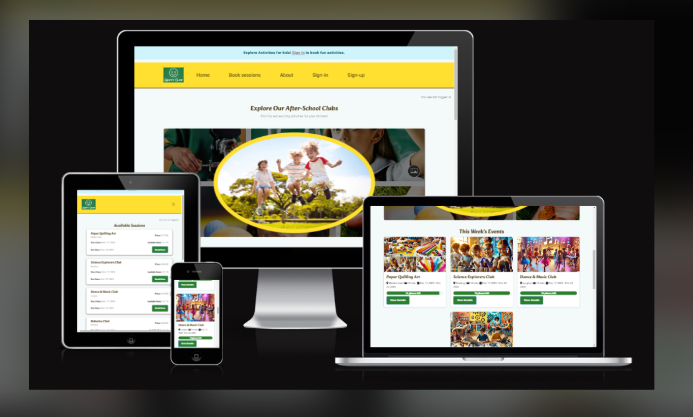
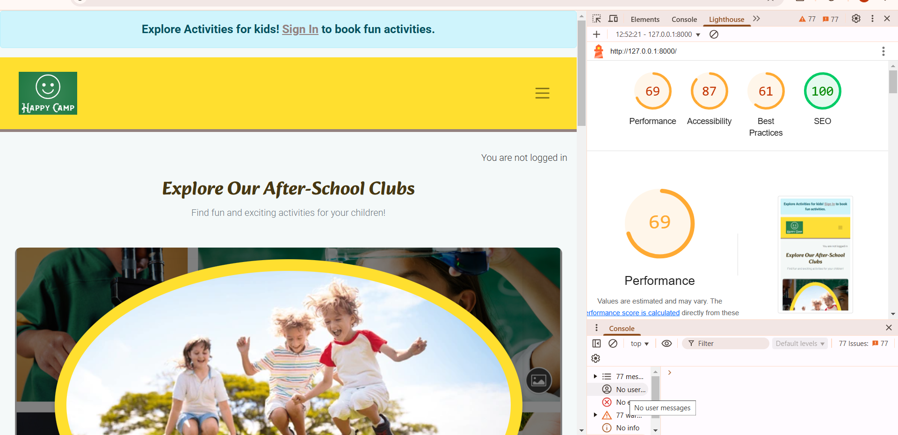
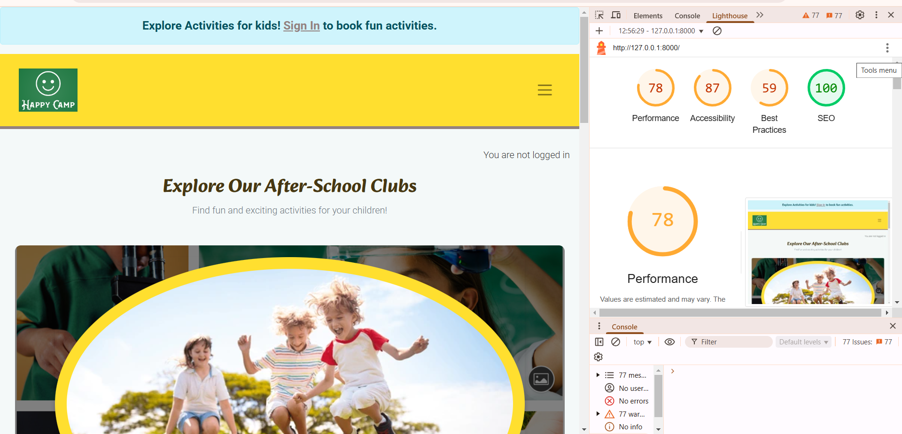

# HappyCamp

## Introduction

Welcome to HappyCamp! This project is the culmination of our efforts as a team at Code Institute. Our previous project laid the foundation for this new and exciting venture, where we aim to enhance the after school activities experience through innovative technology and user-friendly design.

## Deployed Website

You can visit the Live View [Live view](https://happycamp-ae37c2bbbeef.herokuapp.com/).

## Purpose

The purpose of HappyCamp is to provide a comprehensive platform that enhances the after school activities experience for children, parents, and organizers. By leveraging innovative technology, we aim to streamline the management of activities, improve communication, and create an engaging and user-friendly environment for all users.

## Am I Responsive?

To ensure that HappyCamp is accessible on all devices, we have utilized the AmIResponsive tool. This tool allows us to preview how our website looks on different screen sizes and devices, ensuring a seamless user experience regardless of the device being used.



## Agile Methodology

Our project follows Agile methodology, which promotes iterative development, collaboration, and flexibility. This approach allows us to adapt to changes quickly and deliver incremental improvements.

## Project Board

We use a project board to track our progress and manage tasks efficiently. The board is divided into columns such as "To Do," "In Progress," and "Done," providing a clear visual representation of our workflow.

You can view our project board [here](https://github.com/users/praptitambe/projects/12).

## MoSCoW Prioritization

To prioritize our tasks, we use the MoSCoW method, categorizing them into Must have, Should have, Could have, and Won't have. This helps us focus on delivering the most critical features first while maintaining a clear roadmap for future enhancements.

## Must-Have Tasks

- User authentication and authorization
- Parent & child profile management (Store child details for easy booking)
- Club details page (Description, location, and activity info)
- Navigation bar (Home, About Us, Dashboard, Book sessions)
- Responsive design for mobile and desktop

## Should-Have Tasks

- Detail section with CTA (Enroll button)
- Testimonials by users

## Could-Have Tasks

- Social media sharing features
- Pagination
- AI-based activity recommendations
- Offline access to certain features

## UX Design

### Wireframes

Wireframes were created to outline the structure and layout of the HappyCamp website. These wireframes served as a blueprint for the design and development process, ensuring that all necessary elements were included and positioned correctly. Some designs were changed while implementing it.
You can view our wireframes for Desktop 


You can view our wireframes for Mobile 


### Typography

We have carefully selected typography that is both readable and visually appealing. The primary font used throughout the website is 'Roboto', which offers a clean and modern look. This font is complemented by 'Open Sans' for headings, providing a clear hierarchy and enhancing the overall user experience. Alkatra is used for heading.


### Color Palette

Our color palette was chosen to create a vibrant and engaging atmosphere for users. The primary colors used are:


These colors work together to create a cohesive and visually appealing design that enhances the user experience.

## Accessibility Considerations

At HappyCamp, we are committed to making our website accessible to all users, including those with disabilities. Here are some of the considerations we have made:

### Screen Reader Support

- **Semantic HTML**: We use semantic HTML elements (such as `<header>`, `<nav>`, `<main>`, `<section>`, and `<footer>`) to provide meaningful structure to the content, making it easier for screen readers to navigate.
- **ARIA Landmarks**: We have implemented ARIA landmarks to help screen readers identify different sections of the page.
- **Alt Text for Images**: All images include descriptive alt text to provide context for users who rely on screen readers.
- **Form Labels**: All form fields have associated labels to ensure that screen readers can accurately convey the purpose of each input field.
- **Keyboard Navigation**: Our website is fully navigable using a keyboard, allowing users with motor disabilities to access all features without a mouse.

### Color Contrast

- **High Contrast**: We have chosen a color palette with high contrast to ensure that text is readable for users with visual impairments.
- **Accessible Color Combinations**: We have tested our color combinations to ensure they meet WCAG guidelines for color contrast.

### Responsive Design

- **Mobile-Friendly**: Our website is designed to be responsive, providing a seamless experience on mobile, tablet, and desktop devices.
- **Flexible Layouts**: We use flexible layouts and media queries to ensure that content is accessible and readable on all screen sizes.

### Text Resizing

- **Scalable Text**: Our text is scalable, allowing users to increase or decrease font size without breaking the layout.
- **Relative Units**: We use relative units (such as em and rem) for font sizes to ensure that text scales appropriately based on user preferences.

By incorporating these accessibility considerations, we aim to create an inclusive and user-friendly experience for all visitors to HappyCamp.

License
This project is licensed under the MIT License. See the LICENSE file for more information.

This section highlights the accessibility considerations made for users with disabilities, such as screen reader support, color contrast, responsive design, and text resizing. You can add this directly to your `README.md` file to provide a comprehensive overview of the accessibility features of your HappyCamp project.

## Key Features

### Feature 1: User Authentication and Authorization

- **Description**: Users can register, log in, and log out securely. User roles are managed to provide different levels of access.
- **Inclusivity Notes**: The authentication process is designed to be straightforward and accessible, with clear instructions and feedback for users with disabilities.

### Feature 2: Parent & Child Profile Management

- **Description**: Parents can create and manage profiles for their children, storing details for easy booking of activities.
- **Inclusivity Notes**: The profile management interface is designed with accessibility in mind, ensuring that all form fields are labeled and keyboard navigable.

### Feature 3: Club Details and Booking

- **Description**: Users can view detailed information about clubs, including descriptions, locations, and activities. They can also book sessions directly from the club details page.
- **Inclusivity Notes**: The club details page includes high-contrast text and images with alt text, making it accessible to users with visual impairments.


### Feature 4: Responsive Design

- **Description**: The website is fully responsive, providing a seamless experience on mobile, tablet, and desktop devices.
- **Inclusivity Notes**: The responsive design ensures that users with different devices and screen sizes can access the website comfortably.

### Feature 5: Testimonials

- **Description**: Users can read testimonials from other parents, providing social proof and building trust in the platform.
- **Inclusivity Notes**: Testimonials are displayed in a readable format with high contrast, ensuring accessibility for all users.

### Deployment Steps

1. **Create a Heroku Account**: If you don't have a Heroku account, you can create one at [Heroku](https://www.heroku.com/).

2. **Install the Heroku CLI**: Download and install the Heroku CLI from [Heroku CLI](https://devcenter.heroku.com/articles/heroku-cli).

3. **Login to Heroku**: Use the Heroku CLI to log in to your Heroku account.
   ```bash
   heroku login

 Create a New Heroku App: Create a new app on Heroku.

   `heroku create happycamp`

Set Up Environment Variables: Set up the necessary environment variables for your Django project.

    ` heroku config:set DEBUG=False`
    `heroku config:set SECRET_KEY=<your_secret_key>`
    `heroku config:set ALLOWED_HOSTS=happycamp.herokuapp.com`

Add Heroku Postgres: Add the Heroku Postgres add-on to your app.
   
   `heroku addons:create heroku-postgresql:hobby-dev`

Push Code to Heroku: Push your code to the Heroku remote repository.

  `git push heroku main`

Run Migrations: Run the database migrations on Heroku.

  `heroku run python manage.py migrate`

Create a Superuser: Create a superuser for the Django admin interface.

    `heroku run python manage.py createsuperuser `
Open the App: Open your deployed app in the browser.
  
  `heroku open`


By following these steps, you can deploy the HappyCamp project on Heroku and make it accessible to users.

## Verification and Validation
Steps Taken to Verify the Deployed Version Matches the Development Version

1.Functionality Testing: Ensure that all features and functionalities work as expected in the deployed version by performing manual testing and automated tests.
2.User Interface Testing: Verify that the user interface matches the design specifications and is consistent across different devices and screen sizes.
3.Performance Testing: Check the performance of the deployed application to ensure it meets the required standards for speed and responsiveness.
4.Security Testing: Conduct security tests to ensure that the deployed application is secure and free from vulnerabilities.

### Accessibility Checks
1.Screen Reader Testing: Use screen readers to navigate the deployed application and ensure that all content is accessible.
2.Keyboard Navigation: Verify that all interactive elements can be accessed and operated using a keyboard.
3.Color Contrast Testing: Check the color contrast of text and background elements to ensure they meet WCAG guidelines.
4.Text Resizing: Ensure that text can be resized without breaking the layout or functionality of the application.

By performing these verification and validation steps, we ensure that the deployed version of HappyCamp matches the development version in functionality and accessibility.

## AI Implementation and Orchestration

## Code Creation

### Reflection

Strategic use of AI allowed for rapid prototyping, with minor adjustments for alignment with project goals.

### Examples

- **Reverse Prompts**: Used reverse prompts for alternative code solutions, allowing us to explore different approaches and select the most suitable one.
- **Question-Answer Prompts**: Utilized question-answer prompts for resolving specific challenges, ensuring that we could address any issues efficiently and effectively.

## Debugging

### Reflection

Key interventions included resolving logic errors and enhancing maintainability, with a focus on simplifying complex logic to make it accessible.

### Examples

- **Logic Errors**: Identified and resolved logic errors that were causing unexpected behavior in the application.

- **Maintainability**: Refactored code to improve readability and maintainability, ensuring that future developers can easily understand and modify the codebase.

- **Simplifying Complex Logic**: Simplified complex logic to make it more accessible and easier to debug, reducing the likelihood of future errors.

## Performance and UX Optimization

### Reflection

Minimal manual adjustments were needed to apply AI-driven improvements, which enhanced application speed and user experience for all users.

### Examples

- **Performance Enhancements**: Implemented AI-driven suggestions to optimize database queries and reduce load times, resulting in a faster and more responsive application.
- **User Experience Improvements**: Applied AI-driven design recommendations to improve the overall user interface, making it more intuitive and user-friendly.
- **Accessibility Enhancements**: Leveraged AI tools to identify and address accessibility issues, ensuring a more inclusive experience for users with disabilities.





## Manual Unit Testing
## Test Cases

### Test Case 1: User Registration

**Description**: Verify that a new user can register successfully.

**Steps**:
1. Navigate to the registration page.
2. Enter valid user details (username, email, password).
3. Submit the registration form.

**Expected Result**: The user is registered successfully and redirected to the login page.

### Test Case 2: User Login

**Description**: Verify that a registered user can log in successfully.

**Steps**:
1. Navigate to the login page.
2. Enter valid login credentials (username and password).
3. Submit the login form.

**Expected Result**: The user is logged in successfully and redirected to the dashboard.

### Test Case 3: Add New Child Profile

**Description**: Verify that a parent can add a new child profile.

**Steps**:
1. Log in as a parent.
2. Navigate to the "Add Child" page.
3. Enter valid child details (first name, last name, date of birth).
4. Submit the form.

**Expected Result**: The child profile is added successfully and displayed in the parent's dashboard.

### Test Case 4: Book a Club Session

**Description**: Verify that a user can book a club session.

**Steps**:
1. Log in as a user.
2. Navigate to the "Book Sessions" page.
3. Select a club session.
4. Click the "Book Now" button.
5. Confirm the booking.

**Expected Result**: The club session is booked successfully and displayed in the user's bookings.

### Test Case 5: View Club Details

**Description**: Verify that a user can view the details of a club.

**Steps**:
1. Navigate to the "Clubs" page.
2. Select a club.
3. View the club details (description, location, activities).

**Expected Result**: The club details are displayed correctly.

### Test Case 6: Responsive Design

**Description**: Verify that the website is responsive and displays correctly on different devices.

**Steps**:
1. Open the website on a desktop browser.
2. Resize the browser window to different screen sizes (mobile, tablet, desktop).
3. Verify that the layout adjusts correctly.

**Expected Result**: The website layout adjusts correctly for different screen sizes.

### Test Case 7: Accessibility - Screen Reader

**Description**: Verify that the website is accessible using a screen reader.

**Steps**:
1. Open the website with a screen reader enabled.
2. Navigate through the website using the screen reader.
3. Verify that all content is accessible and read correctly by the screen reader.

**Expected Result**: The screen reader reads all content correctly, and all interactive elements are accessible.

### Test Case 8: Keyboard Navigation

**Description**: Verify that the website is fully navigable using a keyboard.

**Steps**:
1. Open the website.
2. Navigate through the website using only the keyboard (Tab, Enter, Arrow keys).
3. Verify that all interactive elements can be accessed and operated using the keyboard.

**Expected Result**: All interactive elements are accessible and operable using the keyboard.

### Test Case 9: Color Contrast

**Description**: Verify that the website meets WCAG guidelines for color contrast.

**Steps**:
1. Open the website.
2. Use a color contrast checker tool to check the contrast of text and background elements.
3. Verify that the color contrast meets WCAG guidelines.

**Expected Result**: The color contrast meets WCAG guidelines for all text and background elements.

### Test Case 10: Text Resizing

**Description**: Verify that text can be resized without breaking the layout or functionality.

**Steps**:
1. Open the website.
2. Use the browser's text resizing feature to increase and decrease the text size.
3. Verify that the text resizes correctly and the layout remains intact.

**Expected Result**: The text resizes correctly, and the layout remains intact.

## Overall Impact

### Reflection

AI tools streamlined repetitive tasks, enabling focus on high-level development.

### Examples

- **Efficiency Gains**: 
  - **Faster Debugging**: AI tools helped identify and resolve issues quickly, reducing the time spent on debugging.
  - **Comprehensive Testing**: Automated test generation and execution ensured thorough testing coverage, improving the reliability of the application.
  - **Improved Code Quality**: AI-driven code suggestions and refactoring enhanced the overall quality and maintainability of the codebase.

- **Challenges**: 
  - **Contextual Adjustments**: AI-generated outputs sometimes required contextual adjustments to align with project goals and standards. These adjustments were made effectively, ensuring the final implementation met the desired requirements.
  - **Inclusivity Enhancements**: AI tools were used to identify and address accessibility issues, making the application more inclusive for users with disabilities.

By leveraging AI tools, the development process for HappyCamp was significantly enhanced, resulting in a more efficient, reliable, and inclusive application.

# Testing Summary
## Manual Testing

### Devices and Browsers Tested

- **Devices**: 
  - Desktop (Windows, macOS)
  - Tablet (iPad, Android)
  - Mobile (iPhone, Android)

- **Browsers**: 
  - Google Chrome
  - Mozilla Firefox
  - Safari
  - Microsoft Edge

- **Assistive Technologies**: 
  - Screen Readers (NVDA, VoiceOver)
  - Keyboard-Only Navigation

### Features Tested

- User Registration and Login
- Parent & Child Profile Management
- Club Details and Booking
- Responsive Design
- Accessibility Features (Screen Reader Support, Keyboard Navigation, Color Contrast, Text Resizing)
- Navigation and CRUD Operations

### Results

- All critical features worked as expected, including accessibility checks.
- The application was fully navigable using a keyboard.
- Screen readers accurately read all content and interactive elements.
- Color contrast met WCAG guidelines.
- Text resizing did not break the layout or functionality of the application.

# Future Enhancements
# Future Enhancements

### Potential Improvements

1. **Enhanced User Profiles**: 
   - Allow users to upload profile pictures.
   - Add more detailed information fields for children and parents.

2. **Advanced Search and Filtering**: 
   - Implement advanced search and filtering options for clubs and activities.
   - Allow users to filter by location, age group, activity type, and availability.

3. **Notifications and Reminders**: 
   - Add email and SMS notifications for upcoming bookings and events.
   - Implement reminders for parents about upcoming activities and deadlines.

4. **Social Features**: 
   - Enable users to share their bookings and experiences on social media.
   - Add a feature for parents to leave reviews and ratings for clubs and activities.

5. **Mobile App**: 
   - Develop a mobile app for iOS and Android to provide a more seamless experience for users on the go.

6. **Integration with Calendar Apps**: 
   - Allow users to sync their bookings with popular calendar apps like Google Calendar and Apple Calendar.

7. **Enhanced Accessibility Features**: 
   - Continuously improve accessibility features based on user feedback and new guidelines.
   - Implement voice command functionality for easier navigation.

8. **AI-Based Recommendations**: 
   - Use AI to recommend activities and clubs based on user preferences and past bookings.

9. **Offline Access**: 
   - Provide offline access to certain features, allowing users to view their bookings and activities without an internet connection.

10. **Expanded Payment Options**: 
    - Integrate additional payment gateways to provide more options for users.

By implementing these future enhancements, we aim to continuously improve the HappyCamp platform and provide an even better experience for our users.

# Acknowledgements

We would like to express our gratitude to the following individuals and organizations for their support and contributions to the HappyCamp project:

- **Code Institute**: For providing the educational resources, guidance, and support that made this project possible. The comprehensive curriculum and mentorship were invaluable in helping us develop our skills and complete this project successfully.
  - **Roo**
  - **Spencers**
  - **Emma**

- **Team Members**:
  - **Prapti**: For your leadership, dedication, and hard work throughout the project. Your contributions were essential to the success of HappyCamp.
  - **Zalak**: For your dedication, hard work, and collaboration throughout the project. Your contributions were essential to the success of HappyCamp.
  - **Sonali**: For your creativity, problem-solving skills, and teamwork. Your efforts greatly enhanced the quality and functionality of the project.

Thank you all for your support and contributions to the HappyCamp project. We couldn't have done it without you!


