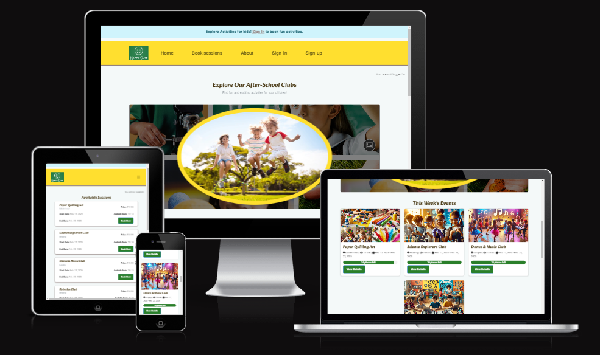
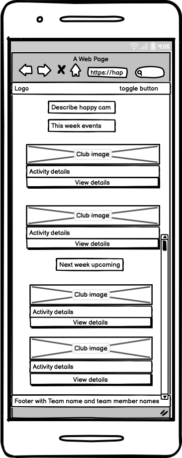

# HappyCamp

## Introduction

Welcome to HappyCamp! This project is the culmination of our efforts as a team at Code Institute. Our previous project laid the foundation for this new and exciting venture, where we aim to enhance the after school activities experience through innovative technology and user-friendly design.

## Deployed Website

You can visit the Live View [Live view](https://happycamp-ae37c2bbbeef.herokuapp.com/).

## Purpose

The purpose of HappyCamp is to provide a comprehensive platform that enhances the after school activities experience for children, parents, and organizers. By leveraging innovative technology, we aim to streamline the management of activities, improve communication, and create an engaging and user-friendly environment for all users.

## Am I Responsive?

To ensure that HappyCamp is accessible on all devices, we have utilized the AmIResponsive tool. This tool allows us to preview how our website looks on different screen sizes and devices, ensuring a seamless user experience regardless of the device being used.

## Agile Methodology

Our project follows Agile methodology, which promotes iterative development, collaboration, and flexibility. This approach allows us to adapt to changes quickly and deliver incremental improvements.

## Project Board

We use a project board to track our progress and manage tasks efficiently. The board is divided into columns such as "To Do," "In Progress," and "Done," providing a clear visual representation of our workflow.

You can view our project board [here](https://github.com/users/praptitambe/projects/12).

## MoSCoW Prioritization

To prioritize our tasks, we use the MoSCoW method, categorizing them into Must have, Should have, Could have, and Won't have. This helps us focus on delivering the most critical features first while maintaining a clear roadmap for future enhancements.

## Must-Have Tasks

- User authentication and authorization
- Parent & child profile management (Store child details for easy booking)
- Club details page (Description, location, and activity info)
- Navigation bar (Home, About Us, Dashboard, Book sessions)
- Responsive design for mobile and desktop

## Should-Have Tasks

- Detail section with CTA (Enroll button)
- Testimonials by users

## Could-Have Tasks

- Social media sharing features
- Pagination
- AI-based activity recommendations
- Offline access to certain features

## UX Design

### Wireframes

Wireframes were created to outline the structure and layout of the HappyCamp website. These wireframes served as a blueprint for the design and development process, ensuring that all necessary elements were included and positioned correctly. Some designs were changed while implementing it.
You can view our wireframes for Desktop 

You can view our wireframes for Mobile 

### Typography

We have carefully selected typography that is both readable and visually appealing. The primary font used throughout the website is 'Roboto', which offers a clean and modern look. This font is complemented by 'Open Sans' for headings, providing a clear hierarchy and enhancing the overall user experience. Alkatra is used for heading.

### Color Palette

Our color palette was chosen to create a vibrant and engaging atmosphere for users. The primary colors used are:

These colors work together to create a cohesive and visually appealing design that enhances the user experience.

## Accessibility Considerations

At HappyCamp, we are committed to making our website accessible to all users, including those with disabilities. Here are some of the considerations we have made:

### Screen Reader Support

- **Semantic HTML**: We use semantic HTML elements (such as `<header>`, `<nav>`, `<main>`, `<section>`, and `<footer>`) to provide meaningful structure to the content, making it easier for screen readers to navigate.
- **ARIA Landmarks**: We have implemented ARIA landmarks to help screen readers identify different sections of the page.
- **Alt Text for Images**: All images include descriptive alt text to provide context for users who rely on screen readers.
- **Form Labels**: All form fields have associated labels to ensure that screen readers can accurately convey the purpose of each input field.
- **Keyboard Navigation**: Our website is fully navigable using a keyboard, allowing users with motor disabilities to access all features without a mouse.

### Color Contrast

- **High Contrast**: We have chosen a color palette with high contrast to ensure that text is readable for users with visual impairments.
- **Accessible Color Combinations**: We have tested our color combinations to ensure they meet WCAG guidelines for color contrast.

### Responsive Design

- **Mobile-Friendly**: Our website is designed to be responsive, providing a seamless experience on mobile, tablet, and desktop devices.
- **Flexible Layouts**: We use flexible layouts and media queries to ensure that content is accessible and readable on all screen sizes.

### Text Resizing

- **Scalable Text**: Our text is scalable, allowing users to increase or decrease font size without breaking the layout.
- **Relative Units**: We use relative units (such as em and rem) for font sizes to ensure that text scales appropriately based on user preferences.

By incorporating these accessibility considerations, we aim to create an inclusive and user-friendly experience for all visitors to HappyCamp.

License
This project is licensed under the MIT License. See the LICENSE file for more information.

This section highlights the accessibility considerations made for users with disabilities, such as screen reader support, color contrast, responsive design, and text resizing. You can add this directly to your `README.md` file to provide a comprehensive overview of the accessibility features of your HappyCamp project.
This section highlights the accessibility considerations made for users with disabilities, such as screen reader support, color contrast, responsive design, and text resizing. You can add this directly to your `README.md` file to provide a comprehensive overview of the accessibility features of your HappyCamp project.